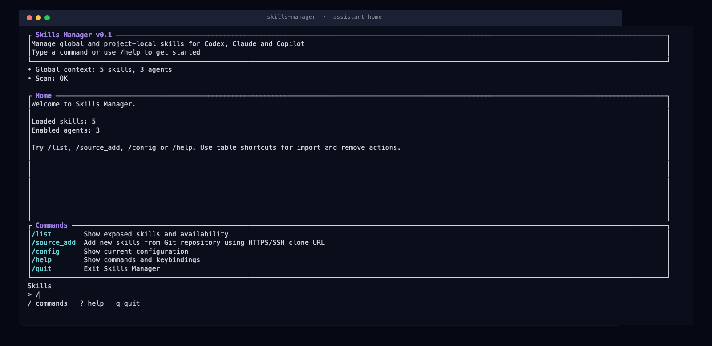
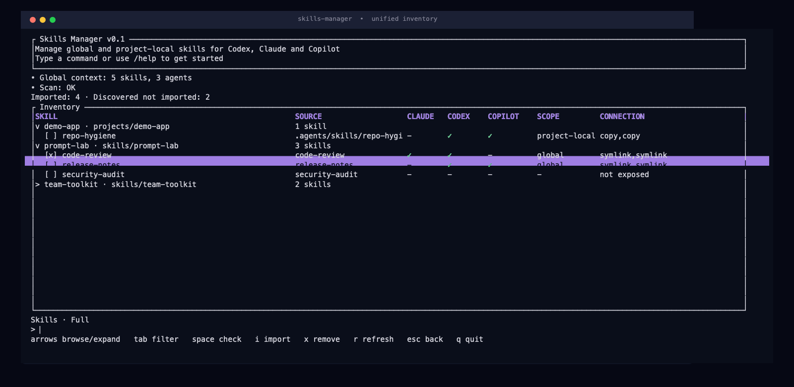

# Skills Manager

> See every skill, source, and agent exposure in one terminal-first workflow.

## Homebrew

Install the native macOS release from the shared tap:

```bash
brew install jboczek/tap/skills-manager
```

At startup, the TUI checks Homebrew for a newer version without blocking the
skill scan. When one is available it displays the version in the header; enter
`/update` to fetch it, install it, and restart the application. To update from
the shell instead:

```bash
brew update
brew upgrade skills-manager
```

The formula is maintained in the public [jboczek/homebrew-tap](https://github.com/jboczek/homebrew-tap) repository. The first release supports Apple Silicon and Intel Macs; Linux, Windows, bottles, and casks are not included.

Prepare a new release from a clean, synchronized `main` checkout with:

```bash
./scripts/local-release.sh
```

The helper reads the package version through Cargo metadata, requires it to be
greater than the latest published `vX.Y.Z` tag, creates `release/vX.Y.Z` from
`origin/main`, and pushes the matching tag after the branch. The tag starts
the release workflow automatically.

## Assistant-style TUI
Skills Manager is a Rust CLI/TUI for discovering directories that contain
`SKILL.md` and managing their exposures to Codex, Claude, and Copilot. It
builds one privacy-safe inventory, groups skills by source repository, and
shows the exact filesystem plan before a mutation is applied.

## TUI at a glance

Run `skills-manager` without a subcommand to open the full-screen assistant
interface. The prompt, status feed, grouped inventory, and keyboard hints stay
in one place, so the common workflow never leaves the terminal.

<p align="center">
  
</p>

From `/list`, the unified inventory combines real exposures with discovered
skills that are not exposed yet. Groups start collapsed; expand one to see
repository-relative skill paths, agent availability, scope, and connection
type.

<p align="center">
  
</p>

The table keeps seven stable columns: `SKILL`, `SOURCE`, `CLAUDE`, `CODEX`,
`COPILOT`, `SCOPE`, and `CONNECTION`. Project-local rows are visible but
read-only, while discovery-only rows can be imported without implying an
existing exposure.

## Highlights

- Browse global and project-local skill exposures together with unexposed
  discoveries.
- Group large inventories by repository with bounded, privacy-safe path
  labels.
- Import from a selected discovery or add a managed Git source from the TUI.
- Preview staged import and removal plans before touching the filesystem.
- Keep CLI commands available for scripts, diagnostics, and non-interactive
  workflows.

## Quick start

Requirements: Rust stable and an interactive terminal.

```bash
git clone https://github.com/jboczek/skills-manager.git
cd skills-manager

# Generate the default config once.
cargo run -- config init

# Open the assistant-style TUI.
cargo run
```

The generated config uses `~/skills` as the central source directory and
configures global targets for Claude, Codex, and Copilot. Edit the TOML if
your source roots or agent directories differ, then launch the TUI again.

For a release build:

```bash
cargo build --release
./target/release/skills-manager
```

## TUI workflow

### Command palette

Press `/` from an empty prompt. The palette provides:

```text
/list                         Browse exposed and discovered skills
/source_add <clone-url>       Add a source from an HTTPS or SSH clone URL
/config                       Show the resolved config and TOML
/help                         Show commands and keybindings
/update                       Install the latest Homebrew version and restart
/quit                         Exit Skills Manager
```

### Inventory navigation

| Key | Action |
|---|---|
| `Up` / `Down` | Move through visible source groups and skill rows. |
| `Left` / `Right` | Collapse a group, expand it, or move to its first skill. |
| `Tab` | Cycle `Full`, `Only exposed`, and `Only discovered not applied`. |
| `Space` | Check or uncheck a skill row for a batch import. |
| `i` | Import the selected skill or checked skills to enabled agents. |
| `x` | Remove a selected global exposure; discovery-only and project-local rows are protected. |
| `r` | Refresh the list while keeping the active filter and matching selection. |
| `Esc` | Cancel the current flow and return home. |
| `?` | Open help from an empty prompt. |
| `q` | Quit from an empty prompt. |

### Safe mutations

Import and remove use the same staged-plan flow as the CLI:

1. Select a skill row and start the action.
2. Review the paths and operations in the rendered plan.
3. Confirm before applying it.
4. Let the app rescan and show the resulting inventory.

Symlink removals detach the exposure without deleting the source skill.
Removing a physical copy is marked as destructive and requires an additional
exact `yes` confirmation.

## CLI commands

The CLI is the scriptable fallback for the same configured source and target
model:

```bash
skills-manager scan
skills-manager list
skills-manager doctor

skills-manager config init
skills-manager config path
skills-manager config show

skills-manager source add https://github.com/example/skills.git
skills-manager import repo-a/code-review --to claude,codex
skills-manager remove repo-a/code-review --from claude
```

`scan` is read-only. `list` reports current exposures, `doctor` checks the
global setup, and `import` / `remove` print a plan and ask for confirmation
before applying filesystem changes.

## Configuration

The active configuration contains three small pieces:

- `skills.central_dir`: the primary source directory scanned first.
- `skills.scan_parent_dirs`: additional parent directories to scan.
- `skills.max_scan_depth`: the bounded recursive scan depth, defaulting to
  `10`.

Active paths must be absolute or begin with `~`; relative paths are rejected
before scanning or plan creation. The config also defines enabled agent
targets and the shared `.agents/skills` target used by Codex and Copilot.

## Development

Run the standard checks before submitting a change:

```bash
cargo fmt --check
cargo check --locked
cargo test --locked
cargo clippy --all-targets --all-features -- -D warnings
```

Product context and durable feature notes live in [`docs/`](docs/), including
the [TUI feature notes](docs/features/assistant-style-tui-shell.md) and the
[roadmap](docs/roadmap.md).
